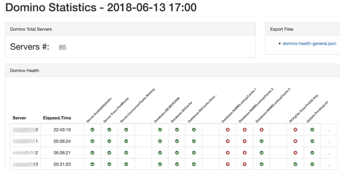
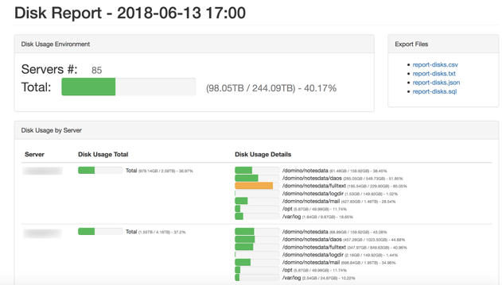

# domo.py
Monitoring Tool for IBM Domino

You must enable 


### Domino General Report



### Disk Report



## Collect the Stats

Domo.py generate reports using show stats output.

Follow instructions [IBM Domino: Monitoring the health of you Domino Server using HTTP and show stats](http://ebasso.net/wiki/index.php?title=IBM_Domino:_Monitoring_the_health_of_you_Domino_Server_using_HTTP_and_show_stats).

## Configuration

Configure using **configs/domino_config.json** file, ee example included.


## Running

Run command like:

```
cd domo/src

python domo.py --collect --domino_statistics --domino_mail --traveler_statistics --report_disks
```